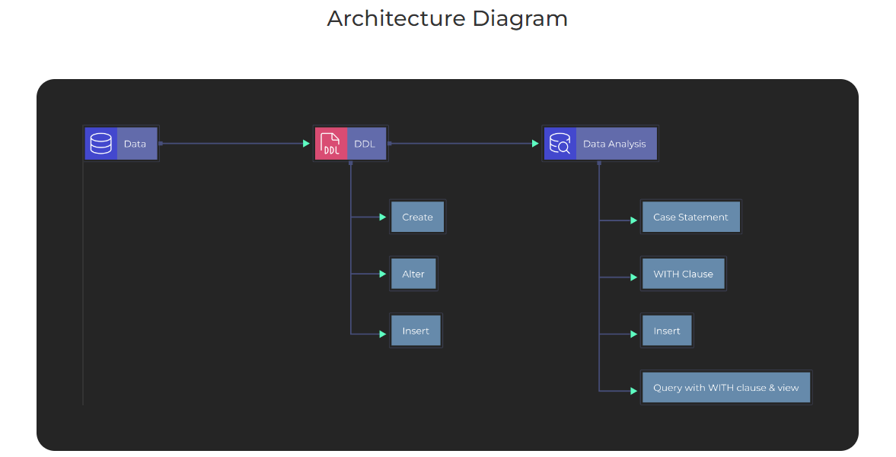

# SQL-Data-Analysis-Part-4
SQL Project for Data Analysis using Oracle Database-Part 4

### What is Dataset Analysis? 
Dataset Analysis is defined as manipulating or processing unstructured or raw data to draw valuable insights and conclusions that will help derive critical decisions that add some business value. The dataset analysis process is followed by organizing the dataset, transforming the dataset, visualizing the dataset, and finally modeling the dataset to derive predictions for solving the business problems, making informed decisions, and effectively planning for the future.

### Oracle SQL Developer :
Oracle SQL Developer is a free IDE that makes it easy to develop and operate Oracle Database in both traditional and cloud environments. SQL Developer is a complete end-to-end development of PL/SQL jobs, worksheets for running queries and scripts,  DBA  for database administration, reporting interfaces, and comprehensive data modeling output.

### What is the Agenda of the project? 
This is the fourth project in the SQL project series; the third project involved the data analysis using Sub-query, Group-by clause, and Exists clause. It also consists of using inline view and aggregate functions(Min, Max, Count, Avg) to perform better analysis on data. This project involves the data analysis using WITH clause, the difference between COUNT(*) and COUNT(column_name), Categorization using the CASE statement, and various real-life case studies/problem statements.

### Tech stack:  

● SQL Programming language

● Oracle SQL Developer

### Dataset Used

Hers is the DDL commands: [DDL.sql](https://github.com/Raghuraj-DataEngineer/SQL-Data-Analysis-Part-4/blob/main/DDL.sql)

Here is the Data Analysis queries:

[Data_Analysis.sql](https://github.com/Raghuraj-DataEngineer/SQL-Data-Analysis-Part-4/blob/main/Data_Analysis.sql)

### Key Takeaways:

● Understanding the project and how to use Oracle SQL Developer

● Understanding the basics of data analysis, SQL commands, and their application

● Understanding the use of Oracle SQL Developer

● Understanding the difference between COUNT(*) and COUNT(column_name).

● Data analysis using WITH clause.

● Categorization using CASE statement.

● Understanding the inline view.

● Simplify query with WITH clause and View. 

● Understanding the use of the ROWNUM clause.

### Data Analysis

● count(1) vs count(column_name).

● CASE STATEMENT: Categorize employees based on hire date.

● WITH Clause.

● Simplify query with WITH clause and View.

● Fetch employee record with third MAX salary without Analytical 	function.

● Find duplicate location ID along with details.

● Select unique city along with location details.

● Display city in a comma separated manner like Bern, Bombay etc.

● Find all the employees whose salary is not in job range.

